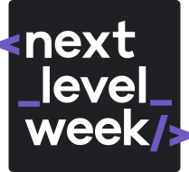
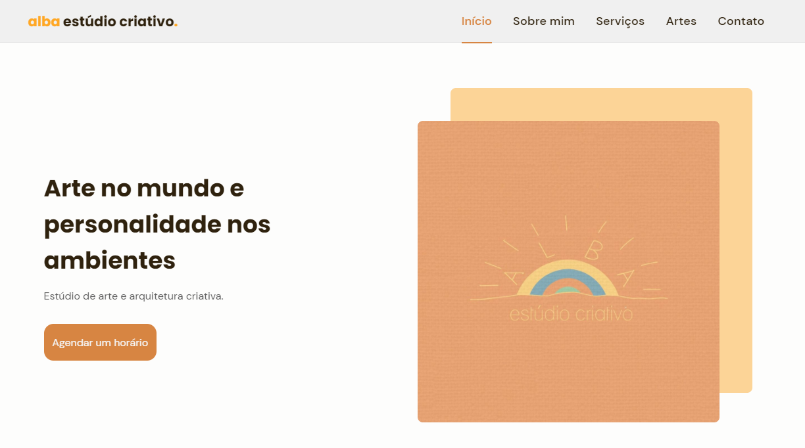

<h1 align="center">
    
</h1>

# Rocketseat's NextLevelWeek #06 :rocket:

This online event, hosted by [Rocketseat](https://rocketseat.com.br/)'s team, happened between July 21 and 27, 2021. 
The focus was create an application from the beggining, fully functional and ready for user's use.

There are plenty different modules on this event, like Flutter, React, Node.js... and this project was about HTML, CSS and JavaScript.

## Alba :art:

<h1 align="center">
    
</h1>

The alba atelier is a creative studio, owned by [@estudioalba](https://www.instagram.com/estudioalba/), which offers several art and architecture services.

All the HTML, CSS and JavaScript were made by me and [Mayk Brito](https://github.com/maykbrito), one of the educators from Rocketseat.
This website was designed to be visually pleasing and to have an easier way to know more about the atelier, as well as expose some of the works and ease contact.

## Showcase :tv:

Designed to fit in any screen size, the website works perfectly and maintains its dimensions both on smartphones and tablets, as well as notebooks and desktops!

### Web :desktop_computer:

<h1 align="center">
    
</h1>

### Mobile :iphone:

<h1 align="center">
  
 </h1>
 
 #### <h3 align="center">You can check the website [here](https://giobroliatto.github.io/alba-project/)</h3>
 
